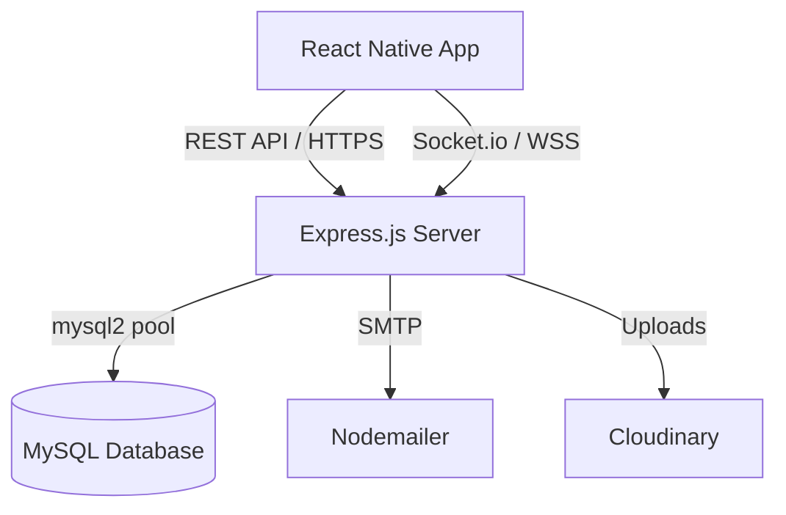
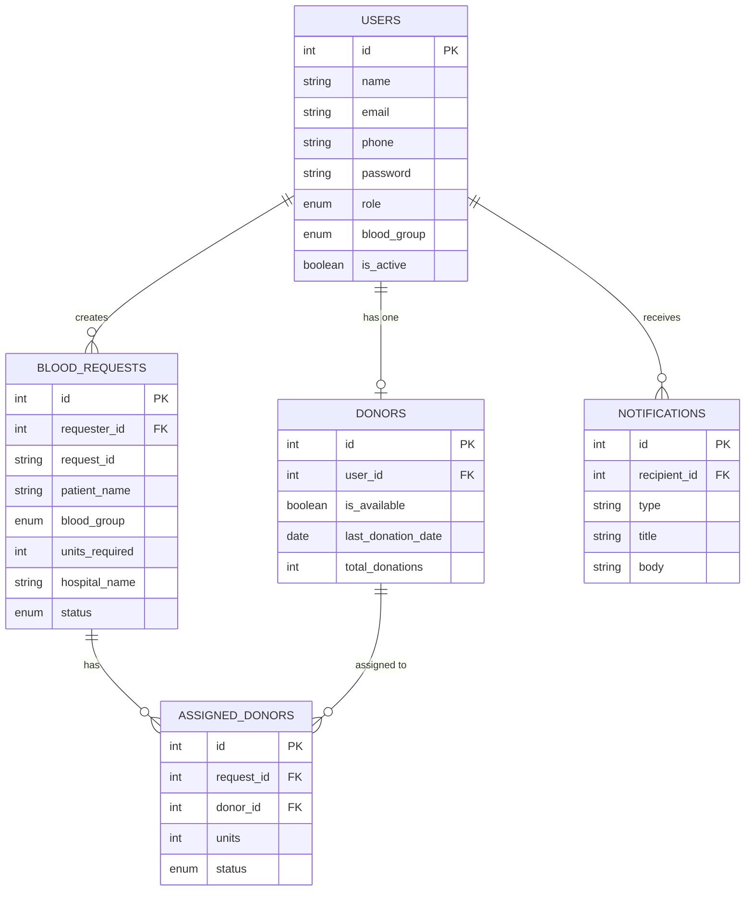
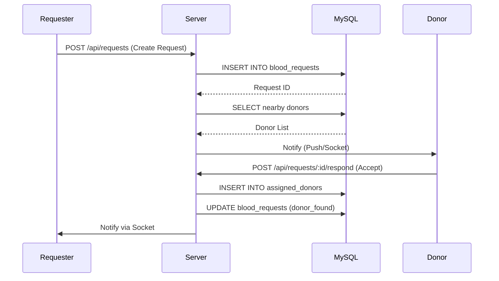

# RedDrop AI (MySQL Backend)

Emergency blood donor and tracking system built with React Native (Expo), Node.js, Express, **MySQL**, Socket.io, Cloudinary, and JWT authentication.

This project has been completely migrated from MongoDB to a normalized MySQL relational database structure to ensure robust data integrity, ACID compliance, and better performance for structured queries.

## Project Overview

RedDrop AI is a mobile-first application for coordinating blood requests, donor discovery, request tracking, and authenticated user workflows in real time.

## Tech Stack

| Layer | Technology |
| --- | --- |
| Mobile App | React Native + Expo |
| Backend | Node.js + Express.js |
| **Database** | **MySQL (mysql2/promise)** |
| Authentication | JWT + bcryptjs |
| Realtime | Socket.io |
| Storage | Multer + Cloudinary |
| Email | Nodemailer |

## Architecture Diagram



## Entity-Relationship (ER) Diagram



## API Flow Diagram (Blood Request Lifecycle)



## Folder Structure

```text
RedDropAI/
├── backend/
│   ├── config/          # DB & Socket configurations
│   ├── controllers/     # API request handlers
│   ├── database/        # schema.sql and seed.sql
│   ├── middleware/      # Auth and Upload middleware
│   ├── routes/          # Express route definitions
│   ├── services/        # Email and AI Verification logic
│   ├── utils/           # Helper functions
│   └── server.js        # Entry point
├── frontend/            # React Native Expo app
└── README.md
```

## Installation

```bash
cd RedDropAI/backend
npm install
```

## Environment Variables

Create a `.env` file in the `backend/` directory:

```env
PORT=5000
NODE_ENV=development

# MySQL DB
DB_HOST=localhost
DB_PORT=3306
DB_USER=root
DB_PASSWORD=your_password
DB_NAME=reddrop_ai

# Security
JWT_SECRET=super_secret_key
JWT_EXPIRES_IN=7d
```

## Database Setup (MySQL)

1. Ensure MySQL is running on your system.
2. Log into your MySQL console or a tool like phpMyAdmin/DBeaver.
3. Run the schema script to create tables:
   ```bash
   mysql -u root -p < backend/database/schema.sql
   ```
4. Insert dummy data using the seed script (optional):
   ```bash
   mysql -u root -p < backend/database/seed.sql
   ```

## Run the Server

```bash
cd backend
npm run dev
```

## API Documentation

### Auth Endpoints
- `POST /api/auth/register`: Register new user/donor. (Body: `name`, `email`, `phone`, `password`, `role`)
- `POST /api/auth/login`: Login user. (Body: `email`, `password`)
- `GET /api/auth/me`: Get current authenticated user profile. (Headers: `Authorization: Bearer <token>`)

### Donor Endpoints
- `GET /api/donors/nearby`: Fetch nearby active donors using Haversine formula SQL query. (Query: `latitude`, `longitude`, `bloodGroup`)
- `GET /api/donors/profile`: Get authenticated donor profile.
- `PUT /api/donors/availability`: Toggle donor availability. (Body: `isAvailable`)

### Blood Request Endpoints
- `POST /api/requests`: Create a new blood request. (Body: `patientName`, `bloodGroup`, `unitsRequired`, `hospital`, etc.)
- `GET /api/requests`: Fetch blood requests (filtered by role and status).
- `GET /api/requests/:id`: Get detailed request info including assigned donors.
- `POST /api/requests/:id/respond`: Accept or decline a blood request. (Body: `action`: `accept` or `decline`)
- `PATCH /api/requests/:id/status`: Update the request lifecycle status. (Body: `status`)

## Future Improvements
- Refactor all controllers fully into the Repository Pattern to decouple SQL logic from Express routes.
- Implement comprehensive unit and integration tests using Jest.
- Integrate a robust queue system (e.g., BullMQ) for background tasks instead of `setTimeout`.
- Expand real-time tracking for active blood transports.
