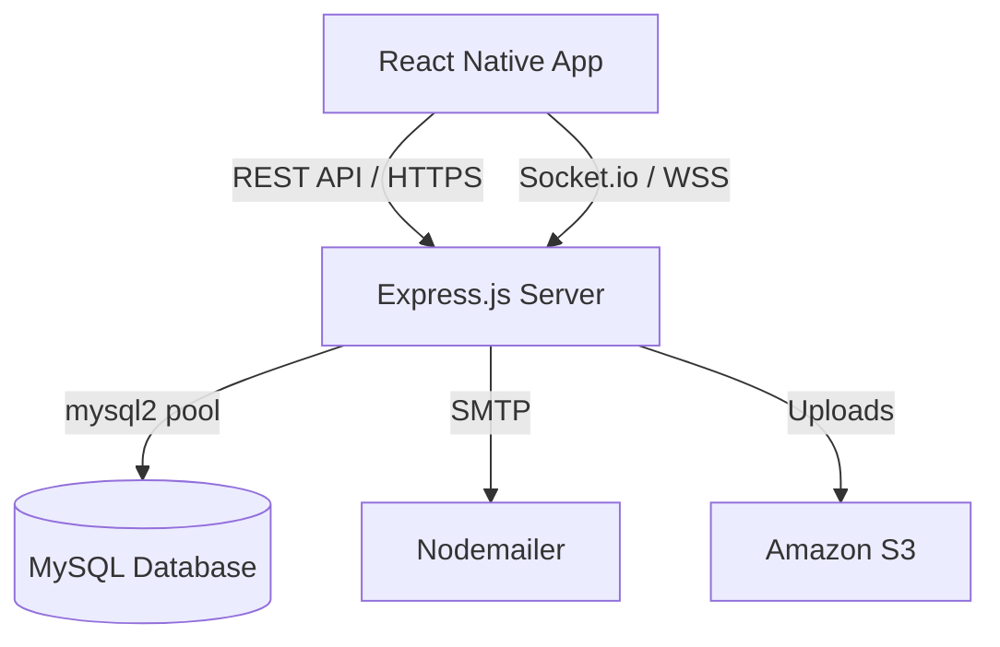

<div align="center">
  
  
  
  
  <h1>🩸 RedDrop AI</h1>
  <p><strong>Emergency Blood Donor & Real-Time Tracking System</strong></p>
</div>

---

RedDrop AI is a powerful mobile-first application that connects blood donors with patients in emergency situations. This repository contains the **Express.js / Node.js Backend**, completely migrated to a normalized **MySQL** relational database to ensure robust data integrity, ACID compliance, and high-speed geospatial donor matching.

## ✨ Key Features

- **🛡️ Secure Authentication:** JWT-based auth with bcrypt hashed passwords and email OTP verification.
- **🗺️ Geospatial Donor Matching:** Uses the Haversine formula directly in MySQL to instantly find available donors near hospitals.
- **⚡ Real-Time Tracking:** Integrated `Socket.io` pushes instant live updates and notifications to donors and requesters.
- **🏥 Role-Based Access:** Distinct modules for Donors, Receivers, Hospitals, and Admins.
- **🖼️ Media Handling:** Profile avatars and medical report uploads directly integrated with Amazon S3.
- **📧 Transactional Emails:** Nodemailer integration for automated OTPs and alerts.

## 🛠️ Tech Stack

| Layer | Technology |
| --- | --- |
| **Mobile App** | React Native + Expo |
| **Backend API** | Node.js + Express.js |
| **Database** | **MySQL (mysql2/promise connection pool)** |
| **Authentication**| JWT + bcryptjs |
| **Realtime** | Socket.io |
| **Storage** | Multer + Amazon S3 |
| **Email** | Nodemailer |

## 🏗️ System Architecture

Our backend utilizes a cleanly structured MVC pattern. The complete set of Architectural, ER, and Sequence Diagrams can be found in our [Architecture Documentation](docs/ARCHITECTURE.md).



## 📂 Project Structure

```text
RedDropAI/
├── backend/
│   ├── config/          # Database (MySQL pool) & Socket configurations
│   ├── controllers/     # API request handlers (Auth, Donors, Requests)
│   ├── database/        # schema.sql and seed.sql
│   ├── middleware/      # Authentication & File Upload middleware
│   ├── routes/          # Express route definitions
│   ├── services/        # Email and AI Verification logic
│   └── server.js        # Application Entry Point
├── docs/                # Comprehensive API & Architecture Diagrams
└── README.md
```

## 🚀 Quick Start (Local Development)

### 1. Clone & Install
```bash
git clone https://github.com/yourusername/RedDropAI.git
cd RedDropAI/backend
npm install
```

### 2. Configure Environment Variables
Create a `.env` file in the `backend/` directory:
```env
PORT=5000
NODE_ENV=development

# MySQL DB
DB_HOST=localhost
DB_PORT=3306
DB_USER=root
DB_PASSWORD=your_password
DB_NAME=reddrop_ai

# Security
JWT_SECRET=super_secret_key
JWT_EXPIRES_IN=7d
```

### 3. Database Setup (MySQL)
Ensure MySQL is running. Run the provided SQL scripts to create tables and insert dummy data:
```bash
mysql -u root -p < database/schema.sql
mysql -u root -p < database/seed.sql
```

### 4. Run the Server
```bash
npm run dev
```

## 📖 API Documentation

Detailed API endpoint documentation can be found in the [API Documentation](docs/API_DOCUMENTATION.md). 

### Core Endpoints summary:
- **Auth:** `POST /api/auth/register`, `POST /api/auth/login`, `POST /api/auth/verify-otp`
- **Donors:** `GET /api/donors/nearby`, `PUT /api/donors/availability`
- **Requests:** `POST /api/requests`, `GET /api/requests/:id`, `POST /api/requests/:id/respond`

## 🔮 Future Roadmap
- Transition remaining logic to the Repository Pattern to fully decouple SQL queries from Express controllers.
- Implement comprehensive E2E testing using Jest and Supertest.
- Migrate background email tasks to a Redis queue (BullMQ).

---

<div align="center">
  <i>If you find this project helpful, please consider leaving a ⭐</i>
</div>
