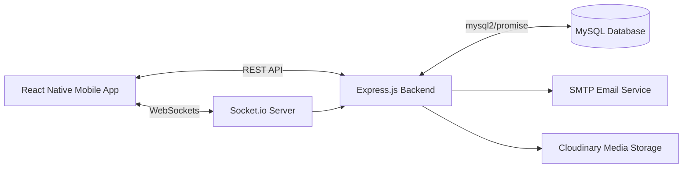
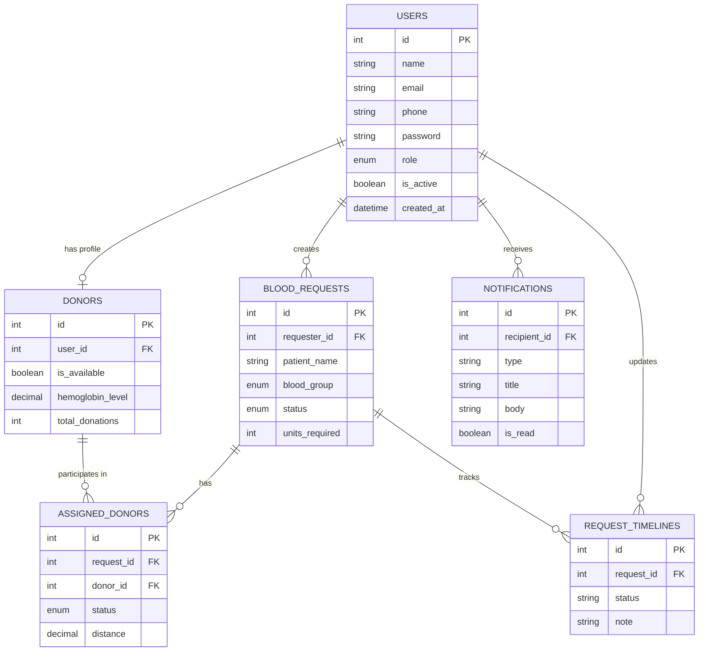
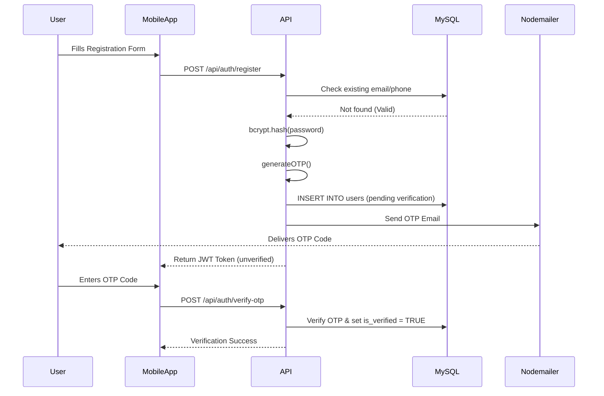
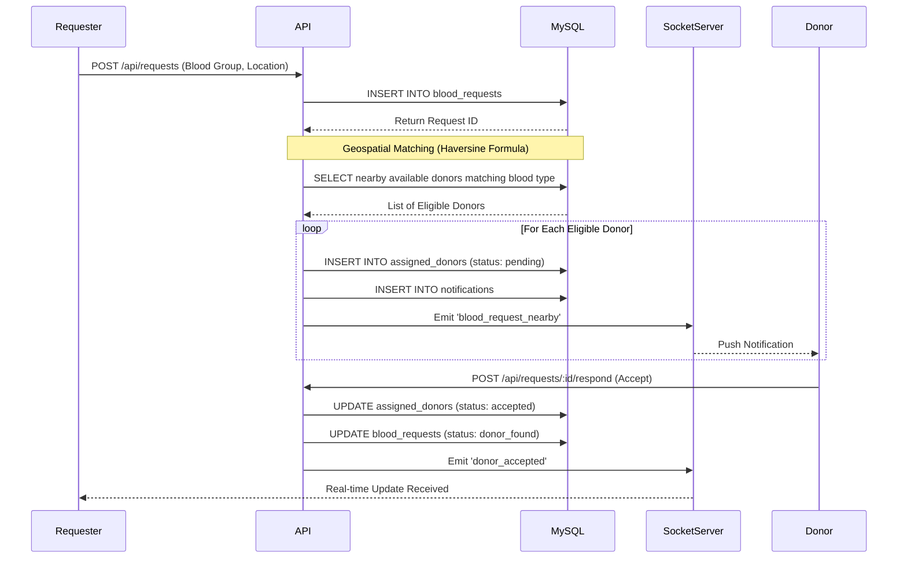

# System Architecture

RedDrop AI employs a robust, scalable client-server architecture. Following the migration from MongoDB to MySQL, the backend now leverages a fully normalized relational database, ensuring ACID compliance, data integrity, and high-performance geospatial querying.

---

## 1. System Architecture Diagram

This diagram illustrates the high-level interaction between the mobile client, the REST API, the real-time server, and external services.

---

## 2. Entity-Relationship (ER) & Database Relationship Diagram

The normalized MySQL database schema ensures structured relationships between users, donors, blood requests, and notifications.

---

## 3. Authentication Flow Diagram

This sequence details the secure registration and JWT-based authentication flow, including OTP verification via Email.

---

## 4. Blood Request Sequence Diagram

This diagram visualizes the lifecycle of a blood request, from creation to finding and notifying nearby eligible donors using MySQL geospatial logic.

---

## Architecture Layers Overview

- **Mobile Client:** Built with React Native (Expo). Utilizes React Query for API state management and caching, and `socket.io-client` for real-time tracking.
- **API Gateway / Controllers:** Express.js handles incoming HTTP REST requests. Controllers execute business logic and interact directly with the database pool.
- **Database Layer:** `mysql2/promise` provides asynchronous database connectivity using a connection pool for efficiency.
- **Security:** `helmet`, `cors`, `express-rate-limit`, `bcryptjs`, and `jsonwebtoken` protect the API against common vulnerabilities.
