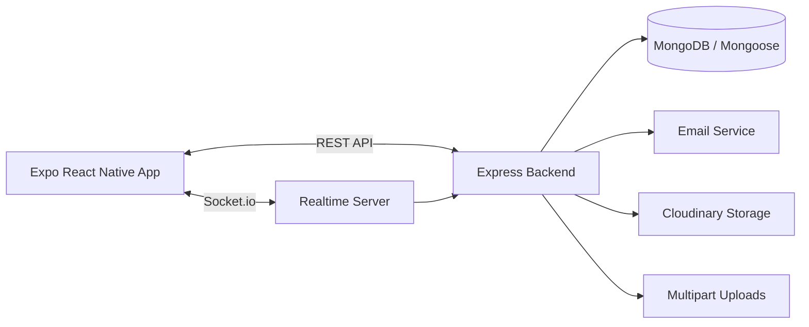

# Architecture

Red Drop AI uses a simple client-server architecture.

## Layers

### Frontend

The Expo app handles authentication screens, donor discovery, request creation, request tracking, profile management, and notifications. It uses React Query, secure storage, and Socket.io client helpers.

### Backend

The Express API is organized by feature area. Controllers and services handle authentication, donor data, blood requests, notifications, uploads, and email delivery.

### Data

MongoDB stores users, donors, blood requests, and notifications through Mongoose models.

### Real-Time Updates

Socket.io is used for authenticated live events and request-related updates.

### External Services

- Cloudinary for media storage
- SMTP for transactional email
- Google Maps API from the mobile client configuration
